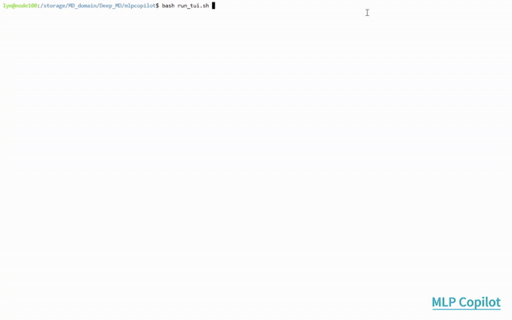

<h1 align="center">MLP Copilot</h1>

<p align="center">
  Runtime d'agent vertical pour les workflows de potentiel d'apprentissage automatique
</p>

<p align="center">
  <a href="./README.md">English</a> |
  <a href="./README.zh-CN.md">中文</a> |
  <a href="./README.fr.md">Français</a> |
  <a href="./README.ja.md">日本語</a>
</p>

MLP Copilot est un runtime d'agent vertical pour les workflows de potentiel
d'apprentissage automatique. Il cible aujourd'hui les opérations
DeepMD-kit / DP-GEN : initialisation du workspace, vérification des
configurations, projection de l'état d'exécution, suivi des artefacts,
inspection des logs et actions de contrôle validées par un humain.

<p align="center">
  <a href="./data/videos/Video1_mlp_ai_agents.mp4">
    
  </a>
</p>

<p align="center">
  <a href="./data/videos/Video1_mlp_ai_agents.mp4">Voir la demo MP4 complete</a>
</p>

## Capacités

| Domaine | Capacité |
| --- | --- |
| Runtime hôte | Agent loop, sessions, mémoire, TUI, passerelles Telegram/API, client MCP, workspace, approvals, index d'artefacts |
| Plugins MLP | Préparation du dataset initial, contrôle DP-GEN, validation de datasets, évaluation de modèles, rapports, recherche documentaire locale |
| Traçabilité | Run manifests, hashes d'artefacts, décisions d'approbation, logs d'outils, projections d'état |
| Contrôle humain | Approbations bloquantes pour actions coûteuses ou destructrices |

Le runtime reste la couche hôte. Les algorithmes scientifiques, la sémantique
DP-GEN, l'inférence checkpoint, les benchmarks et la validation de données
doivent rester dans les serveurs MCP ou les skills.

## Données de simulation et DigAuto

Le répertoire `data/` a été migré depuis l'ancien projet
[`flarecentury/Auto-MLP`](https://github.com/flarecentury/Auto-MLP) vers MLP
Copilot. Il contient des trajectoires de dynamique moléculaire pour la
combustion de nanoparticules d'aluminium dans
[`data/MDtrajs/`](./data/MDtrajs/) et les vidéos de visualisation
correspondantes dans [`data/videos/`](./data/videos/), couvrant des systèmes
bare-metal et core-shell à plusieurs températures.

L'AI agent, les trained machine learning potential (MLP) models et le
comprehensive dataset (contenant environ 90 000 atomic configurations avec DFT
energies/forces) sont tous hébergés sur la plateforme Digital Automation for
Scientific Discovery (DigAuto) :
[https://www.digauto.org](https://www.digauto.org).

## Prérequis

- Git.
- Python 3.11 ou plus récent.
- `uv` pour gérer les dépendances.

Installer `uv` si nécessaire :

```bash
python -m pip install --user uv
```

## Installation depuis le code source

```bash
git clone https://github.com/flarecentury/mlpcopilot.git
cd mlpcopilot
uv sync --extra dev
```

Si vous préférez SSH :

```bash
git clone git@github.com:flarecentury/mlpcopilot.git
cd mlpcopilot
uv sync --extra dev
```

Vérifier la CLI :

```bash
uv run mlpcopilot --help
uv run mlpcopilot mlp capabilities
```

## Configuration d'Agentic File Search

Le package MCP `agentic-file-search` fourni avec le dépôt utilise son propre
fichier d'environnement. Utilisez
[`mlpcopilot/mcps/agentic-file-search/.env.example`](./mlpcopilot/mcps/agentic-file-search/.env.example)
comme modèle, ou lancez son script d'initialisation :

```bash
cd mlpcopilot/mcps/agentic-file-search
scripts/init-skill.sh
```

Configurez `FS_EXPLORER_MCP_ROOT`, `FS_EXPLORER_DB_PATH` et l'endpoint
OpenAI-compatible optionnel dans ce fichier. Ces paramètres sont séparés de la
configuration principale `~/.mlpcopilot/config.json`.

## Première utilisation

Créer la configuration locale et le workspace par défaut :

```bash
uv run mlpcopilot onboard
```

Workspace par défaut :

```text
~/.mlpcopilot/workspace
```

Initialiser directement un workspace :

```bash
uv run mlpcopilot mlp init --workspace ~/.mlpcopilot/workspace
```

Ouvrir le poste de travail TUI :

```bash
uv run mlpcopilot tui
```

Afficher un instantané TUI :

```bash
uv run mlpcopilot tui --once
```

Utiliser une configuration et un workspace explicites :

```bash
uv run mlpcopilot tui \
  --config ~/.mlpcopilot/config.json \
  --workspace ~/.mlpcopilot/workspace
```

## Utiliser un répertoire DP-GEN existant

Projeter un répertoire de travail DP-GEN dans le workspace MLP Copilot :

```bash
bash run_tui.sh --dpgen-dir /path/to/dpgen/workdir --no-tui
```

Puis ouvrir le poste de travail :

```bash
uv run mlpcopilot tui --config ~/.mlpcopilot/config.json --session tui:local
```

## Commandes utiles

```bash
uv run mlpcopilot mlp status
uv run mlpcopilot mlp capabilities
uv run mlpcopilot mlp approvals
uv run mlpcopilot mlp runs list
uv run mlpcopilot mlp runs show <run_id>
```

TUI, API et Telegram :

```bash
uv run mlpcopilot tui
uv run mlpcopilot serve
uv run mlpcopilot gateway
```

Mettre à jour un checkout existant :

```bash
git pull --ff-only
uv sync --extra dev
```

## Documents du projet

Avant de modifier le comportement produit ou l'implémentation, lire :

1. [`AGENTS.md`](./AGENTS.md)
2. [`PROJECT.md`](./PROJECT.md)
3. [`prd/MLPCOPILOT_RUNTIME_PRD.md`](./prd/MLPCOPILOT_RUNTIME_PRD.md)
4. [`prd/MLPCOPILOT_MCP_SKILL_PRD.md`](./prd/MLPCOPILOT_MCP_SKILL_PRD.md)
5. [`prd/MLPCOPILOT_TUI_CODEX_INTERACTION_PRD.md`](./prd/MLPCOPILOT_TUI_CODEX_INTERACTION_PRD.md)

## Vérifications de développement

```bash
uv run --extra dev ruff check mlpcopilot tests
uv run --extra dev pytest -q
```

## Licence et remerciements

MLP Copilot est distribué sous licence MIT. Voir [`LICENSE`](./LICENSE).

MLP Copilot s'appuie sur les projets et produits suivants :

- [`HKUDS/nanobot`](https://github.com/HKUDS/nanobot), runtime d'agent généraliste sous licence MIT.
- [`PromtEngineer/agentic-file-search`](https://github.com/PromtEngineer/agentic-file-search), projet de recherche documentaire sous licence MIT adapté comme package MCP `agentic-file-search`.
- [OpenAI Codex](https://openai.com/codex), dont la conception d'interaction pour les workflows développeur a influencé le TUI, les commandes, la visibilité des appels d'outils et l'expérience d'approbation humaine de MLP Copilot.
