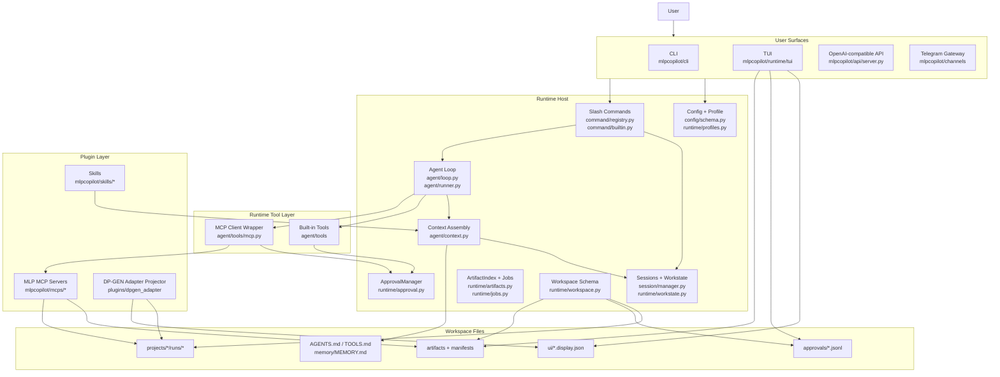
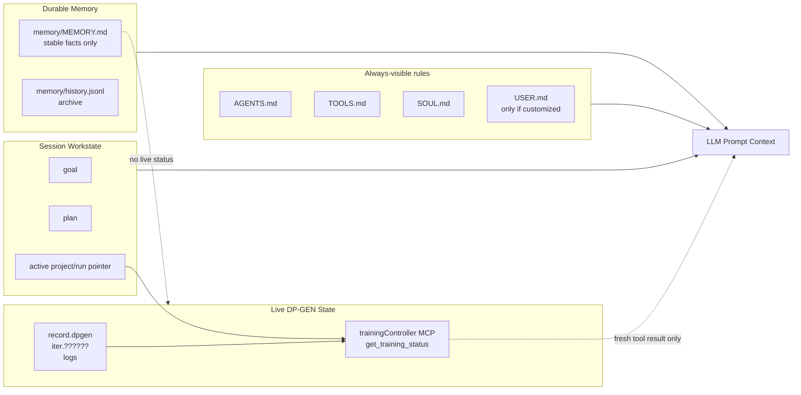
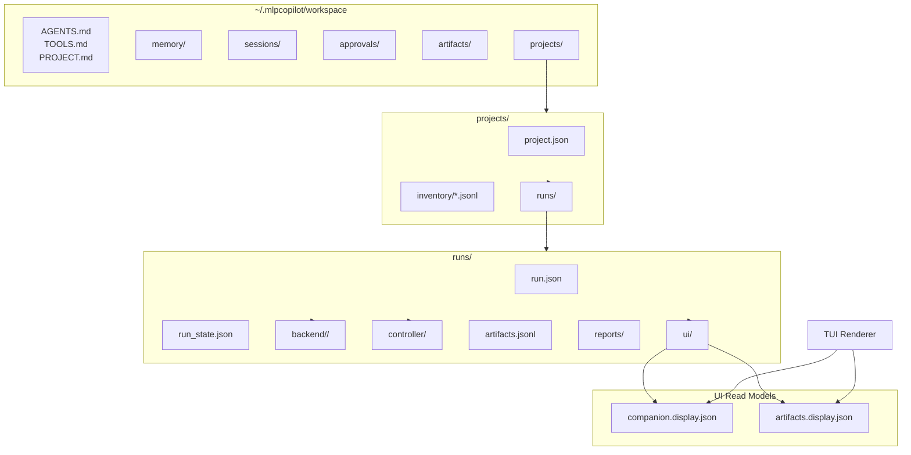
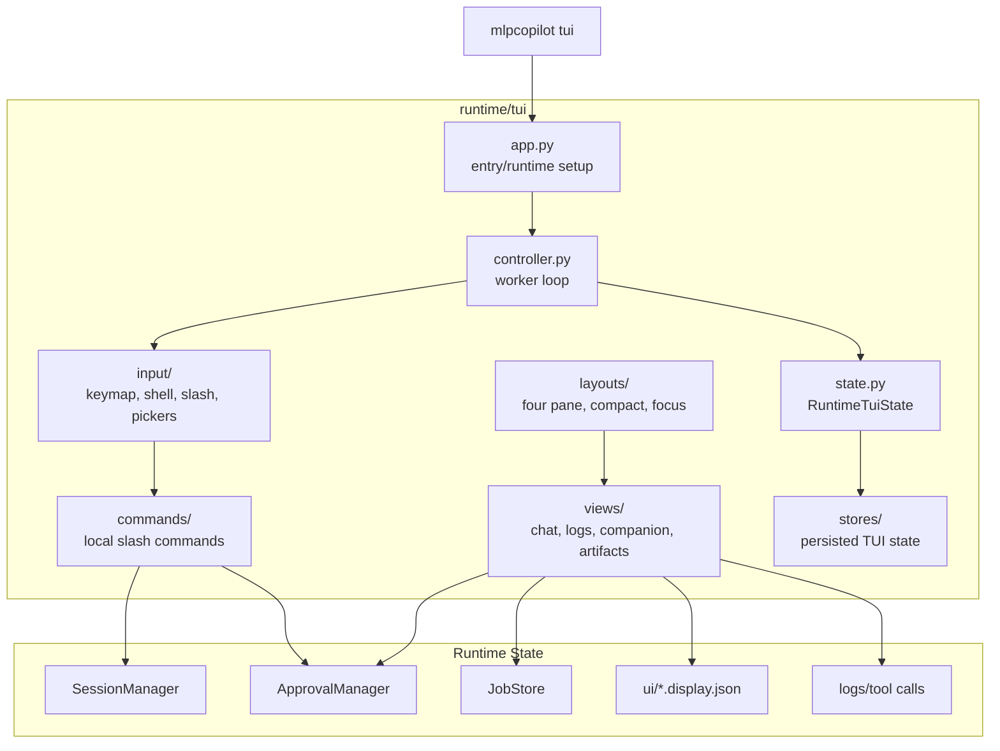
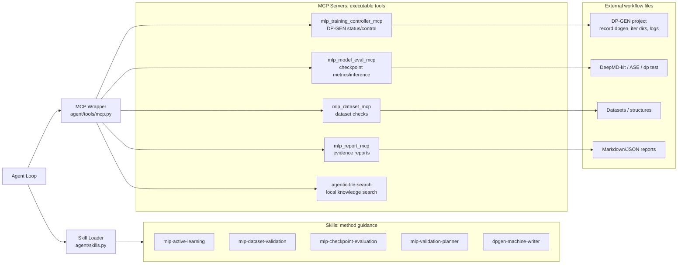
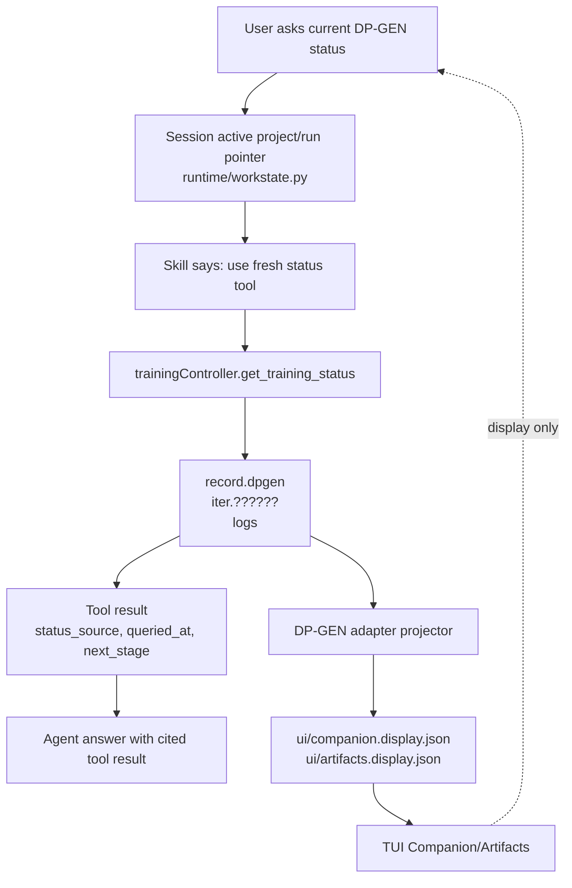

# MLP Copilot Architecture

This document is a code-navigation map for the current MLP Copilot design.
It focuses on where runtime, TUI, workspace, MCP, skills, and MLP-specific
plugins live, so contributors can quickly decide where a change belongs.

Core rule:

- `mlpcopilot` runtime is the host.
- MCP servers execute scientific or workflow tools.
- Skills describe method and workflow guidance.
- Runtime may display plugin outputs, but must not implement MLP science.

## 1. System Layers



## 2. Agent Turn Flow

```mermaid
sequenceDiagram
    participant U as User
    participant Surface as TUI/API/Gateway
    participant Router as Slash Command Router
    participant Loop as Agent Loop
    participant Context as Context Builder
    participant LLM as Provider
    participant Approval as ApprovalManager
    participant Tool as Built-in Tool or MCP Tool
    participant Workspace as Workspace Artifacts

    U->>Surface: message or slash command
    Surface->>Router: normalize slash command
    alt local slash command
        Router->>Workspace: read/update local runtime state
        Router-->>Surface: local response
    else model turn
        Router->>Loop: inbound message
        Loop->>Context: build prompt
        Context->>Workspace: load AGENTS/TOOLS/memory/workstate
        Context-->>Loop: system + context blocks
        Loop->>LLM: chat with tools
        LLM-->>Loop: text or tool call
        Loop->>Approval: evaluate tool policy
        alt approval required
            Approval-->>Surface: pending approval
            U->>Surface: approve/reject/changes
            Surface->>Approval: decision
        end
        Loop->>Tool: execute approved or allowlisted tool
        Tool->>Workspace: write artifacts/logs/read-models if applicable
        Tool-->>Loop: structured result
        Loop->>LLM: continue with tool result
        LLM-->>Surface: final answer
    end
```

Important files:

| Concern | Files |
| --- | --- |
| Command metadata | `mlpcopilot/command/registry.py` |
| Gateway/shared command handlers | `mlpcopilot/command/builtin.py` |
| TUI command dispatch | `mlpcopilot/runtime/tui/commands/` |
| Agent loop and model turn | `mlpcopilot/agent/loop.py`, `mlpcopilot/agent/runner.py` |
| Prompt/context assembly | `mlpcopilot/agent/context.py` |
| Tool approval and resume | `mlpcopilot/runtime/approval.py` |
| MCP tool wrapping | `mlpcopilot/agent/tools/mcp.py` |

## 3. Context and Memory Flow



Precedence for operational facts:

```text
fresh tool result
> current artifact / manifest
> active project/run pointer
> durable memory
> recent chat history
```

Where to change:

| Need | File |
| --- | --- |
| Change bootstrap files injected into prompt | `mlpcopilot/agent/context.py` |
| Change default workspace templates | `mlpcopilot/runtime/workspace.py`, `mlpcopilot/templates/*` |
| Change goal/plan/project pointer behavior | `mlpcopilot/runtime/workstate.py` |
| Change memory hygiene scan | `mlpcopilot/runtime/memory_audit.py` |
| Change Dream memory rules | `mlpcopilot/templates/agent/dream_phase1.md`, `dream_phase2.md` |

## 4. Workspace and Read Models



Runtime reads these files; scientific tools produce or update them.

Where to change:

| Need | File |
| --- | --- |
| Workspace/project/run creation | `mlpcopilot/runtime/workspace.py` |
| Artifact index and manifests | `mlpcopilot/runtime/artifacts.py`, `runtime/artifact_records.py` |
| Runtime job store | `mlpcopilot/runtime/jobs.py` |
| DP-GEN workdir projection into UI read models | `mlpcopilot/plugins/dpgen_adapter/` |
| TUI display document rendering | `mlpcopilot/runtime/tui/views/display_document.py` |
| Companion panel behavior | `mlpcopilot/runtime/tui/views/campaign.py` |

## 5. TUI Architecture



Where to change:

| Need | File |
| --- | --- |
| Add/change TUI layout | `mlpcopilot/runtime/tui/layouts/` |
| Change footer/key hints | `mlpcopilot/runtime/tui/layouts/footer.py` |
| Change key bindings | `mlpcopilot/runtime/tui/input/keymap.py` |
| Change slash menu/completion | `mlpcopilot/runtime/tui/input/completer.py`, `overlays/slash_menu.py` |
| Change command behavior | `mlpcopilot/runtime/tui/commands/` |
| Change Companion pane | `mlpcopilot/runtime/tui/views/campaign.py` |
| Change Tool Log pane | `mlpcopilot/runtime/tui/views/logs.py` |

## 6. MCP and Skill Plugin Boundary



Boundary rule:

| Logic type | Belongs in |
| --- | --- |
| Conversation, sessions, context, approvals, TUI, API | Runtime core |
| Tool policy and MCP wrapping | Runtime core |
| DP-GEN status/control implementation | `mlp_training_controller_mcp` |
| Dataset validation algorithms | `mlp_dataset_mcp` |
| Checkpoint inference/evaluation | `mlp_model_eval_mcp` |
| Report aggregation | `mlp_report_mcp` |
| Workflow method instructions | `mlpcopilot/skills/*` |
| DP-GEN workdir to UI projection | `plugins/dpgen_adapter` |

## 7. DP-GEN Status Flow



The TUI can show projected status, but the agent should call MCP for current
state unless a fresh tool result is already in the same turn.

## 8. Change Map

| If you want to change... | Start here | Avoid |
| --- | --- | --- |
| Default MLP profile policy | `mlpcopilot/runtime/profiles.py` | Mutating explicit user config |
| Config schema | `mlpcopilot/config/schema.py` | Ad-hoc config keys outside schema |
| Slash command list | `mlpcopilot/command/registry.py` | Separate TUI-only/gateway-only duplicate registries |
| Gateway slash behavior | `mlpcopilot/command/builtin.py` | Putting TUI rendering code here |
| TUI local command behavior | `mlpcopilot/runtime/tui/commands/` | Sending local commands to the model |
| Prompt context | `mlpcopilot/agent/context.py` | Injecting large project files |
| Session goal/plan/project pointer | `mlpcopilot/runtime/workstate.py` | Storing live DP-GEN status in memory |
| Approval lifecycle | `mlpcopilot/runtime/approval.py` | Per-MCP approval shims |
| Tool policy | `mlpcopilot/agent/tools/registry.py`, `agent/tools/mcp.py` | Tool-specific approval hacks |
| TUI panes/layout | `mlpcopilot/runtime/tui/layouts/`, `views/` | Reading chat history as runtime truth |
| DP-GEN status/control tools | `mlpcopilot/mcps/mlp_training_controller_mcp/src/` | Runtime core scientific parsing |
| Dataset checks | `mlpcopilot/mcps/mlp_dataset_mcp/src/` | LLM-only validation claims |
| Checkpoint metrics/inference | `mlpcopilot/mcps/mlp_model_eval_mcp/src/` | Old DeePMD-kit assumptions |
| Evidence reports | `mlpcopilot/mcps/mlp_report_mcp/src/` | Inventing missing metrics |
| Workflow guidance | `mlpcopilot/skills/*/SKILL.md` | User-specific current paths in bundled skills |
| Workspace schema | `mlpcopilot/runtime/workspace.py` | Breaking existing project/run files |
| DP-GEN UI projection | `mlpcopilot/plugins/dpgen_adapter/` | Starting/stopping DP-GEN from projector |

## 9. Practical Edit Rules

1. Runtime changes should be generic host behavior.
2. Scientific execution belongs in MCP servers.
3. Scientific methodology belongs in skills.
4. UI should read workspace read-models and runtime state, not chat history.
5. Current DP-GEN state must come from tools or project files, not memory.
6. Large scientific data should move by path, artifact id, manifest id, or hash.
7. Approval is centralized in runtime; MCP tools should not add approval shims.
